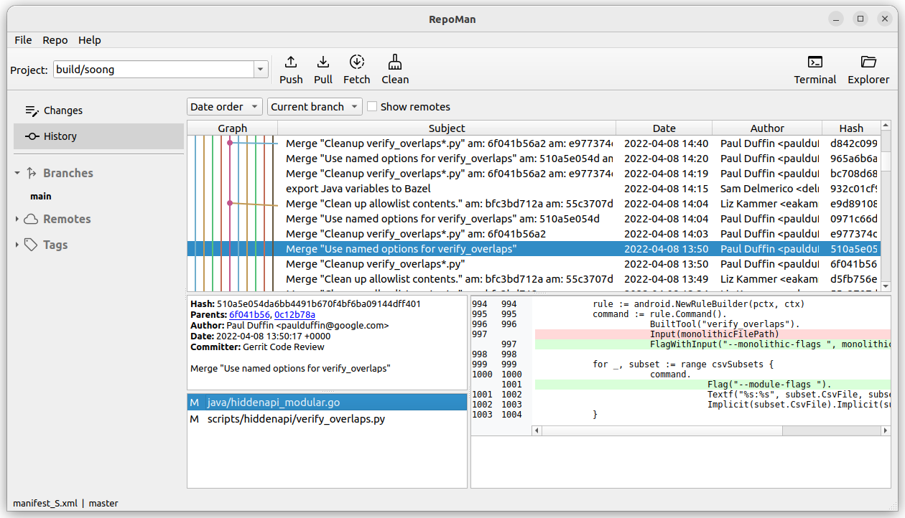

# RepoMan

A git/repo client for AOSP developers.

RepoMan is designed to work with Google's repo tool. No more branch & manifest names copy around!

Special thanks to SourceTree for inspirations.

## System Requirements

RepoMan uses Qt6 so the requirements are the same as Qt.
- Red Hat 8.4
- openSUSE 15.4
- SUSE Linux Enterprise Server 15 SP4
- Ubuntu 20.04

## License
    
    Copyright 2023 by Harry Xu <956175818@qq.com>

    This program is free software: you can redistribute it and/or modify
    it under the terms of the GNU General Public License as published by
    the Free Software Foundation, either version 3 of the License, or
    (at your option) any later version.

    This program is distributed in the hope that it will be useful,
    but WITHOUT ANY WARRANTY; without even the implied warranty of
    MERCHANTABILITY or FITNESS FOR A PARTICULAR PURPOSE.  See the
    GNU General Public License for more details.

    You should have received a copy of the GNU General Public License
    along with this program.  If not, see <https://www.gnu.org/licenses/>.
